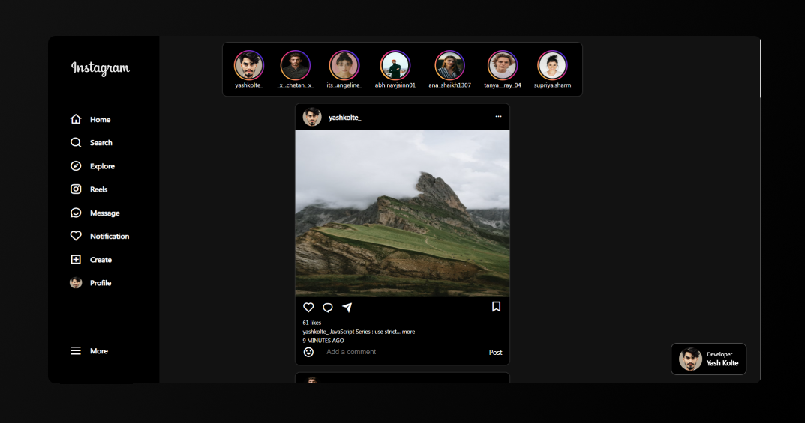

# Reinstagram
### Instagram Web Design

This design is created to show interest in UI design and Development.

<i>Responsive for Desktop only.</i>

## 🔗 Links

## Feedback

If you have any feedback, please reach out to us at yashkolte9@gmail.com

## Inspiration 

Design is inspired from instagram

## Support

If you like this project 😊, please consider supporting it by giving a ⭐️.

